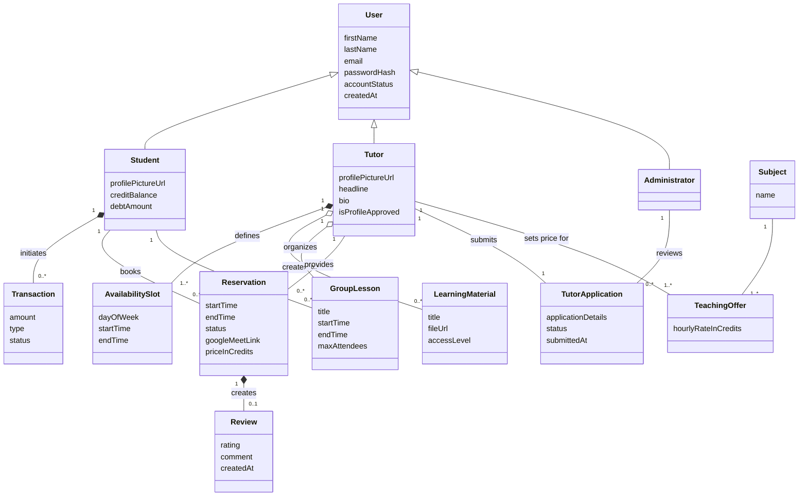

```mermaid
classDiagram
    %% ============================
    %% 1. Core User Hierarchy
    %% ============================
    class User {
        firstName
        lastName
        email
        passwordHash
        accountStatus
        createdAt
    }

    class Student {
        profilePictureUrl
        creditBalance
        debtAmount
    }

    class Tutor {
        profilePictureUrl
        headline
        bio
        isProfileApproved
    }

    class Administrator {
    }

    %% ============================
    %% 2. Classes Strongly Related to Tutor
    %% ============================
    class TutorApplication {
        applicationDetails
        status
        submittedAt
    }

    class AvailabilitySlot {
        dayOfWeek
        startTime
        endTime
    }

    class TeachingOffer {
        hourlyRateInCredits
    }

    class Subject {
        name
    }

    %% ============================
    %% 3. Core Interaction Classes
    %% ============================
    class Reservation {
        startTime
        endTime
        status
        googleMeetLink
        priceInCredits
    }

    class Review {
        rating
        comment
        createdAt
    }

    %% ============================
    %% 4. Other Entities
    %% ============================
    class Transaction {
        amount
        type
        status
    }

    class LearningMaterial {
      title
      fileUrl
      accessLevel
    }

    class GroupLesson {
      title
      startTime
      endTime
      maxAttendees
    }

    %% ============================
    %%       RELATIONSHIPS
    %% ============================

    %% ' -- Inheritance --
    User <|-- Student
    User <|-- Tutor
    User <|-- Administrator

    %% ' -- Composition (Strong "is-composed-of") --
    Reservation "1" *-- "0..1" Review : creates
    Student "1" *-- "0..*" Transaction : initiates
    Tutor "1" *-- "1..*" AvailabilitySlot : defines

    %% ' -- Aggregation (Weak "has-a") --
    Tutor "1" o-- "0..*" LearningMaterial : creates
    Tutor "1" o-- "0..*" GroupLesson : organizes

    %% ' -- Association (General "uses" relationship) --
    Student "1" -- "0..*" Reservation : books
    Tutor "1" -- "0..*" Reservation : provides

    Student "1" -- "0..*" GroupLesson : registers

    Tutor "1" -- "1" TutorApplication : submits
    Administrator "1" -- "0..*" TutorApplication : reviews

    %% ' -- Association Class Connection --
    Tutor "1" -- "1..*" TeachingOffer : sets price for
    Subject "1" -- "1..*" TeachingOffer
```
