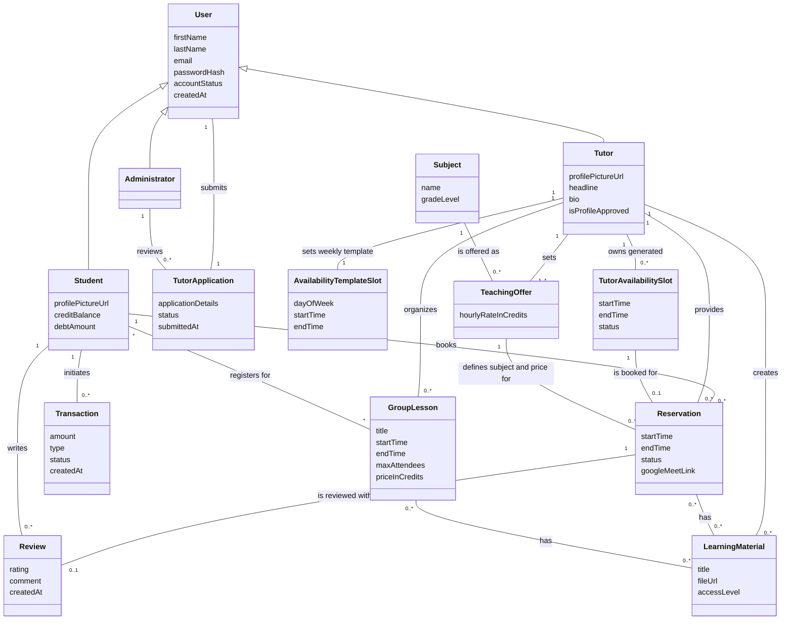

```mermaid
classDiagram
    %% ============================
    %% 1. Core User Hierarchy
    %% ============================
    class User {
        firstName
        lastName
        email
        passwordHash
        accountStatus
        createdAt
    }

    class Student {
        profilePictureUrl
        creditBalance
        debtAmount
    }

    class Tutor {
        profilePictureUrl
        headline
        bio
        isProfileApproved
    }

    class Administrator {
    }

    %% ============================
    %% 2. Classes Related to Tutor & Subjects
    %% ============================
    class TutorApplication {
        applicationDetails
        status
        submittedAt
    }

    class AvailabilityTemplateSlot {
        dayOfWeek
        startTime
        endTime
    }

    class TutorAvailabilitySlot {
        startTime
        endTime
        status
    }

    class TeachingOffer {
        hourlyRateInCredits
    }

    class Subject {
        name
        gradeLevel
    }

    %% ============================
    %% 3. Core Interaction Classes
    %% ============================
    class Reservation {
        startTime
        endTime
        status
        googleMeetLink
    }

    class Review {
        rating
        comment
        createdAt
    }

    %% ============================
    %% 4. Other Entities
    %% ============================
    class Transaction {
        amount
        type
        status
        createdAt
    }

    class LearningMaterial {
      title
      fileUrl
      accessLevel
    }

    class GroupLesson {
      title
      startTime
      endTime
      maxAttendees
      priceInCredits
    }

    %% ============================
    %%       RELATIONSHIPS
    %% ============================

    %% Inheritance
    User <|-- Student
    User <|-- Tutor
    User <|-- Administrator

    %% Associations
    User "1" -- "1" TutorApplication : submits
    Administrator "1" -- "0..*" TutorApplication : reviews

    Tutor "1" -- "1" AvailabilityTemplateSlot : sets weekly template
    Tutor "1" -- "0..*" TutorAvailabilitySlot : owns generated

    Tutor "1" -- "1..*" TeachingOffer : sets
    Subject "1" -- "0..*" TeachingOffer : is offered as

    Student "1" -- "0..*" Reservation : books
    Tutor "1" -- "0..*" Reservation : provides
    TutorAvailabilitySlot "1" -- "0..1" Reservation : is booked for
    TeachingOffer "1" -- "0..*" Reservation : defines subject and price for

    Reservation "1" -- "0..1" Review : is reviewed with
    Student "1" -- "0..*" Review : writes

    Student "1" -- "0..*" Transaction : initiates

    Tutor "1" -- "0..*" LearningMaterial : creates
    Reservation "0..*" -- "0..*" LearningMaterial : has
    GroupLesson "0..*" -- "0..*" LearningMaterial : has

    Tutor "1" -- "0..*" GroupLesson : organizes
    Student "*" -- "*" GroupLesson : registers for
```
