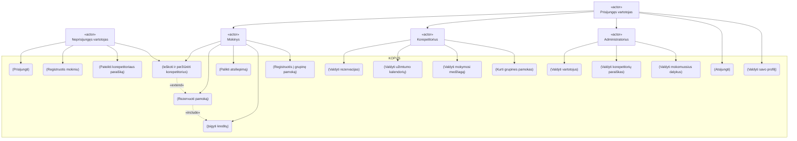

```mermaid
graph TD
    %% 1. Aktorių (Actors) apibrėžimas su &laquo; &raquo; HTML esybėmis
    Anon["&laquo;actor&raquo;<br>Neprisijungęs vartotojas"]
    LoggedInUser["&laquo;actor&raquo;<br>Prisijungęs vartotojas"]
    Student["&laquo;actor&raquo;<br>Mokinys"]
    Tutor["&laquo;actor&raquo;<br>Korepetitorius"]
    Admin["&laquo;actor&raquo;<br>Administratorius"]

    %% 2. Aktorių hierarchijos (Generalization) apibrėžimas
    LoggedInUser --> Student
    LoggedInUser --> Tutor
    LoggedInUser --> Admin

    %% 3. Sistemos ribų (System Boundary) apibrėžimas
    subgraph "KOPUS"
        %% Naudojimo atvejai (Use Cases) kaip suapvalinti stačiakampiai, naudojant (...) sintaksę
        uc_Login("(Prisijungti)")
        uc_RegisterStudent("(Registruotis mokiniu)")
        uc_ApplyTutor("(Pateikti korepetitoriaus paraišką)")
        uc_SearchTutors("(Ieškoti ir peržiūrėti korepetitorius)")
        uc_Logout("(Atsijungti)")
        uc_ManageOwnProfile("(Valdyti savo profilį)")
        uc_ReserveLesson("(Rezervuoti pamoką)")
        uc_LeaveReview("(Palikti atsiliepimą)")
        uc_BuyCredits("(Įsigyti kreditų)")
        uc_RegisterGroupLesson("(Registruotis į grupinę pamoką)")
        uc_ManageReservations("(Valdyti rezervacijas)")
        uc_ManageCalendar("(Valdyti užimtumo kalendorių)")
        uc_ManageMaterials("(Valdyti mokymosi medžiagą)")
        uc_CreateGroupLesson("(Kurti grupines pamokas)")
        uc_ManageUsers("(Valdyti vartotojus)")
        uc_ManageApplications("(Valdyti korepetitorių paraiškas)")
        uc_ManageSubjects("(Valdyti mokomuosius dalykus)")
    end

    %% 4. Ryšių tarp aktorių ir naudojimo atvejų apibrėžimas
    Anon --> uc_Login
    Anon --> uc_RegisterStudent
    Anon --> uc_ApplyTutor
    Anon --> uc_SearchTutors

    LoggedInUser --> uc_Logout
    LoggedInUser --> uc_ManageOwnProfile

    Student --> uc_SearchTutors
    Student --> uc_ReserveLesson
    Student --> uc_LeaveReview
    Student --> uc_BuyCredits
    Student --> uc_RegisterGroupLesson

    Tutor --> uc_ManageReservations
    Tutor --> uc_ManageCalendar
    Tutor --> uc_ManageMaterials
    Tutor --> uc_CreateGroupLesson

    Admin --> uc_ManageUsers
    Admin --> uc_ManageApplications
    Admin --> uc_ManageSubjects

    %% 5. <<extend>> ir <<include>> ryšių apibrėžimas su HTML esybėmis
    uc_SearchTutors -.->|"&laquo;extend&raquo;"| uc_ReserveLesson
    uc_ReserveLesson -.->|"&laquo;include&raquo;"| uc_BuyCredits
```
